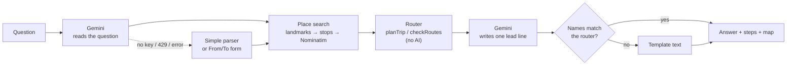

# B.AI — Metro Manila Commute Buddy

**Tell it where you are and where you're going. It tells you which jeep, bus, or train to ride.**

> *"Nasa Pedro Gil Taft ako, papuntang España. Anong bus o jeep ang sasakyan ko?"*

Google Maps draws a line on a map, but it doesn't tell you which **signboard** to look for. B.AI answers the
way a fellow commuter would: what to board (by signboard name), where to get on, where to get off, and where
to transfer. Every answer comes with a map.

A mobile-first chat app for Metro Manila. It understands English, Tagalog, and Taglish, and runs entirely
on free tiers. Personal portfolio project.

<!-- Screenshots: add once deployed, e.g.  -->

## What it can do

- **Plan a trip.** *"Paano pumunta from Cubao to Makati?"* Up to three different ways to get there, with
  signboard placards, numbered steps, rough travel time, and a map with each leg colored by mode.
- **Check the routes you have in mind.** *"Bus papuntang SM Fairview o jeep papuntang Divisoria?"* A yes or no
  for each one, based on the route data, plus a better option if neither works.
- **Use your location.** Starts the trip from where you are (asks permission first and never stores it).
- **Handle unclear places.** Asks *"Alin dito?"* when a name matches several places, and asks for an address
  or a pin on the map when it can't find one.
- **Preferences:** fewest transfers, less walking, trains only, or no trains.
- **Keep working without AI.** If Gemini is down, out of quota, or not set up, B.AI shows From/To boxes and
  still gives routes.

Covers LRT-1 (including the extension to Dr. Santos), LRT-2, MRT-3, city buses (including the EDSA
Carousel), and jeepneys.

## How it works

The AI only reads the question and writes the opening line of the answer. **The routing is plain
TypeScript**, so B.AI never makes up a route.



1. **Read the question.** Gemini turns the message into structured JSON (validated with zod): plan a trip,
   check routes, ask for a missing place, or politely decline an off-topic question.
2. **Find the places.** First a hand-made list of landmarks (stations, schools, malls, local names like
   "Pedro Gil Taft"), then the stop names, then [Nominatim](https://nominatim.org/) limited to Metro Manila
   (1 request per second, cached, with an identifying User-Agent).
3. **Find the routes.** A round-based search (RAPTOR-style, no timetables) over a network built from GTFS
   data. At most 2 transfers, routes ridden forward only, walking transfers within about 300 m, and the top 3
   options that actually differ from each other.
4. **Write the answer.** Gemini writes one short lead line from the router's result. If that line names a
   route the router didn't return, a plain template is used instead. The steps, map, and disclaimer come
   straight from the router data.

## Tech stack

| Part | Choice |
|---|---|
| App | Next.js 16 (App Router), React 19, TypeScript (strict) |
| UI | Tailwind CSS v4, shadcn/ui (Radix), Motion, lucide-react |
| Map | Leaflet + react-leaflet with OpenStreetMap tiles |
| AI | Google Gemini via AI Studio free tier (`@google/genai`): `gemini-3.5-flash-lite`, with `gemini-3.8-flash` as backup |
| Place search | Local landmarks and stops, then Nominatim (OpenStreetMap) |
| Route data | [`sakayph/gtfs`](https://github.com/sakayph/gtfs), turned into a compact JSON network at build time, plus a hand-kept corrections file |
| Validation / tests | zod / vitest |
| Hosting | Vercel Hobby |

No database, no accounts, no paid services.

## Run it locally

Needs **Node.js 22** or newer.

```bash
git clone https://github.com/Rav-alt/B.AI.git
cd B.AI
npm install
cp .env.example .env.local   # then fill in the values below
npm run dev                  # http://localhost:3000
```

The route network (`data/generated/network.json`) is committed, so the app runs without downloading the
GTFS feed.

### Environment variables

| Variable | What it's for |
|---|---|
| `GEMINI_API_KEY` | Google AI Studio key, server-side only. Leave empty to run without AI (From/To mode). |
| `GEMINI_MODEL` | Main model. Empty = `gemini-3.5-flash-lite`. |
| `GEMINI_FALLBACK_MODEL` | Backup used on 429 / 503 / timeout. Empty = `gemini-3.8-flash`; `none` turns it off. |
| `NOMINATIM_CONTACT` | Email for the Nominatim User-Agent. Leave empty to skip Nominatim (landmarks and stops only). |

Keys go in `.env.local` only. It's git-ignored; never commit it.

### Scripts

| Command | What it does |
|---|---|
| `npm run dev` | Start the dev server |
| `npm run build` / `npm start` | Production build / serve it |
| `npm test` | Run the test suite (vitest) |
| `npm run lint` | ESLint |
| `npm run build:data` | Rebuild `data/generated/network.json` from the GTFS feed + corrections |
| `npm run inspect:gtfs` | Print counts, modes, and sample routes from the raw feed |
| `npm run test:gemini` | One test call to Gemini to check the key and model |
| `npm run try:router` | Run the router from the terminal |
| `npm run try:chat -- "Pedro Gil Taft to España"` | Run the full chat pipeline from the terminal |

### Rebuilding the route data

The raw GTFS feed isn't committed. To rebuild the network:

```bash
git clone --depth 1 https://github.com/sakayph/gtfs.git data/raw
npm run build:data
```

Fixes to the old data (new lines, removed routes, renamed signboards) go in `data/corrections.json`. Each
entry needs a `source` and an `updated` date.

## Project structure

```
app/                 page, /limitations, and POST /api/chat
components/          chat UI, route steps, signboards, map card (ui/ = shadcn components)
lib/
  ai/                Gemini client, intent parsing, prompts
  chat/              pipeline, templates, simple parser, name check, rate limit
  data/              GTFS → network build (CSV, modes, names, directions, corrections)
  geo/               place search, Nominatim client, landmarks, distance
  router/            planTrip, checkRoutes, nearby stops, legs
  ui/                view helpers, location hook
data/
  landmarks.json     hand-made landmark list (each with a source)
  corrections.json   fixes on top of the GTFS data
  generated/         network.json (build output, committed)
scripts/             data build, data inspection, try-it scripts
tests/               vitest
docs/                data notes and the learning log
```

More detail: [`PLAN.md`](PLAN.md) (build order and status), [`DESIGN.md`](DESIGN.md) (UI rules),
[`docs/data-notes.md`](docs/data-notes.md) (what's in the data and how it's cleaned), and
[`docs/learning-log/`](docs/learning-log/INDEX.md) (what was built, step by step).

## Limitations

- **Some routes are out of date.** The data is the DOTC GTFS feed from the Philippine Transit App Challenge
  (2015). Many routes changed under PUV modernization and route rationalization. Major changes are patched
  in `data/corrections.json`, but some routes may be gone or missing. Always confirm with the driver,
  barker, or konduktor.
- **No real-time info.** No traffic, breakdowns, queues, or schedules. Travel times are rough estimates.
- **Jeepneys have no fixed stops,** so boarding and drop-off points are approximate.
- **Place search can misread local names** ("Lawton", "Rotonda"). When it's unsure, B.AI asks.
- **Routes only.** No fares, schedules, booking, or places outside Metro Manila.
- **Privacy.** Questions are sent to Google Gemini (free tier) to be read, so don't type personal
  information. Your location is used for that one question and never saved.

## Credits

- Route data provided by **DOTC (now DOTr)**, via the [`sakayph/gtfs`](https://github.com/sakayph/gtfs)
  feed and used under the DOTC Developer License Agreement in that repository.
  **Not affiliated with or endorsed by DOTr.**
- Map data and place search © [OpenStreetMap contributors](https://www.openstreetmap.org/copyright).
- Language understanding by Google Gemini.

Made by Jhon Raven Cadiz.
